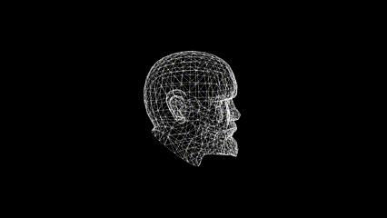
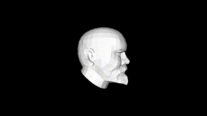
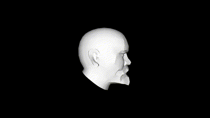
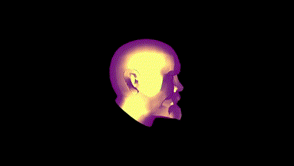
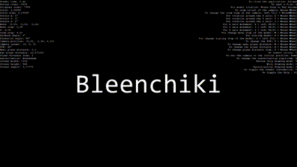
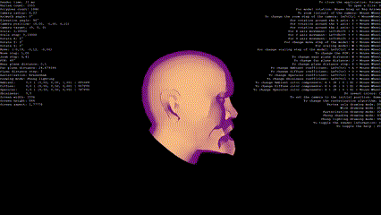

# Rendering on a processor

## Vertex only model drawing mode (0 key)

## Wire model drawing mode (1 key)

## Polygon rasterization model drawing mode (2 key)

## Phong shading model drawing mode (3 key)

## Phong lighting model drawing mode (4 key)

## Drawing with information (I and F1 keys)

